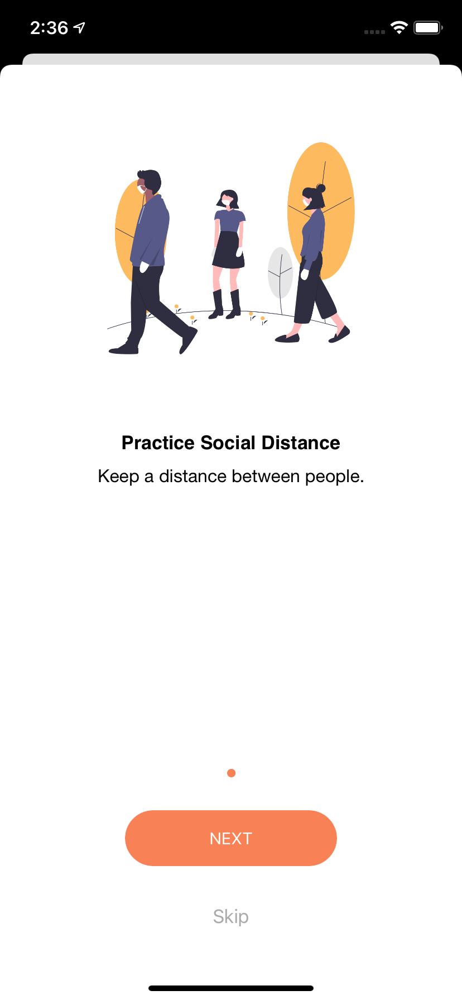

# StaySafe 

Is an iOS Project to track and listen to the lastest covid-19 data from NPGEO Corona API for notify users within a particular location.

# Concept Used
- MVC Architecture
- HTTP Request using URLSession
- DispatchQueue for data rendering 
- User Notifcation Center 
- Firebase Notification
- Get Users Location using CoreLocation
- UITableView
- Codable 

# WalkThrough Pages
  

# Networking 
The app make request to the API for new data using the URLSession GET request method to get the data to be populated in the tableview.

# Home 
This is the general overview of the APP where users can view new updates from the API by requesting to get the data using the URLSession GET request.

# Safe Zone 
This display to users by using specific keywords in the searchbar to get the data from the API e.g ["green", "yellow", "red", "dark-red"] and makes a request to the API to get the data and populate it in the tableview.This educates the users to protect themselves from getting the virus by following saftey measures such as keeping distance, wear a mask or washing hands. 

# Safe Zone Detail View 
Displays to the users satefy measures they need to use to protect themselves and avoid the spread of the virus.

